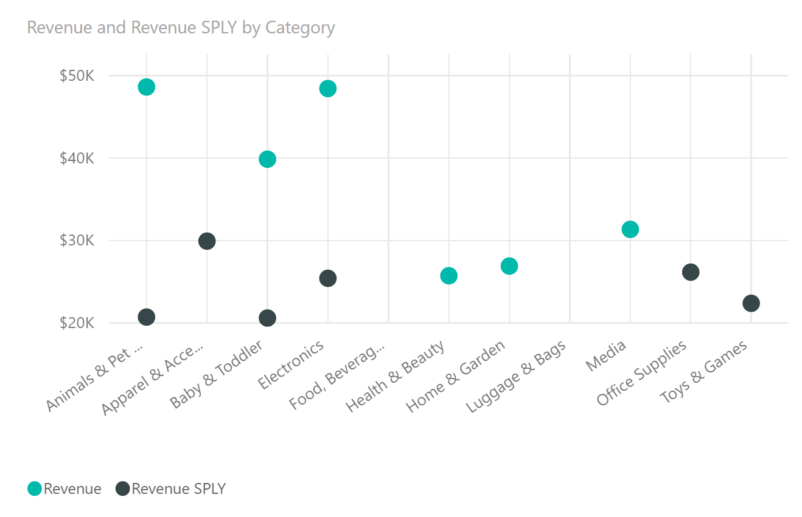

# Dot Plot for Power BI

Dot Plot by OKViz allows you to compare multiple measures by their magnitude, representing each data point with a simple dot.

Find out more on http://okviz.com/dot-plot/

### Copyrights

Copyright (c) 2016-2017 OKViz - trademark of SQLBI Corp.

See the [LICENSE](/LICENSE) file for license rights and limitations (MIT).